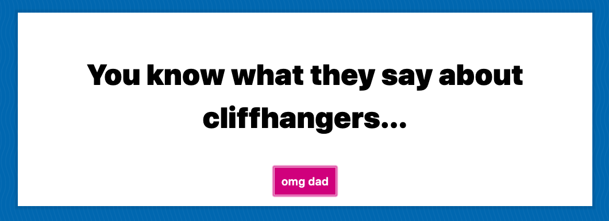

# Dad Jokes 
Simple app built around the open source [icanhazdadjoke] API. Build using only HTML, CSS and JS. The purpose was to understand working with JavaScript and APIs in its purest form. Free coded this this example from a Wes Bos course on JavaScript.

## My Finished Project

### What I've Learned

* Fetch with Acceptance headers 
* Destructuring 
* Using CSS Variables 

:thumbsup: *Thanks for checking out my work on GitHub! For more about me find me on Twitter [@TyeDev](https://twitter.com/tyedev) or visit my personal website [TyeCampbell.com](www.TyeCampbell.com).*
